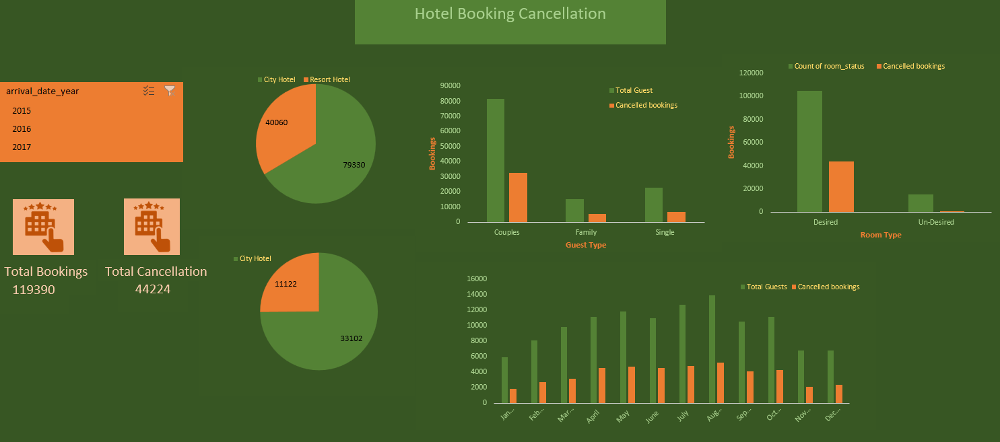

# 🏨 Hotel Booking Cancellation Dashboard

---

## 1. 📌 Project Title / Headline
**Hotel Booking Cancellation Dashboard**

An Excel-based interactive dashboard that analyzes booking patterns, cancellation trends, and guest behaviors in hotel reservations.

---

## 2. 📝 Short Description / Purpose
This project visualizes hotel booking and cancellation trends to identify key patterns like:
- Which hotel types face more cancellations
- What kind of guests are more likely to cancel
- Monthly booking trends
- How room preferences impact cancellations

The dashboard helps hotels and analysts understand customer behavior and improve booking management strategies.

---

## 3. 🛠️ Tech Stack
- **Microsoft Excel**
  - Data Cleaning
  - Pivot Tables
  - Slicers
  - Charts & Visualizations
- Dataset in `.csv` and final dashboard in `.xlsx` format

---

## 4. 📂 Data Source
- Dataset: [Hotel Booking Demand – Kaggle](https://www.kaggle.com/datasets/jessemostipak/hotel-booking-demand)
- File: `hotel_bookings_raw.csv` (original), cleaned and analyzed in Excel

---

## 5. ✨ Features / Highlights
- 📊 **Interactive Filters** (by Year)
- 🧍‍♂️ **Guest Type Analysis** – Couples, Families, Singles
- 🏨 **Hotel Type Breakdown** – City vs. Resort Hotel
- 🛏️ **Room Type Impact** – Desired vs. Undesired rooms
- 📅 **Monthly Trends** – Total guests vs. Cancellations
- 📉 **Total Booking vs. Cancellations KPI cards**

---

##6. 📸 Screenshots / Demos

